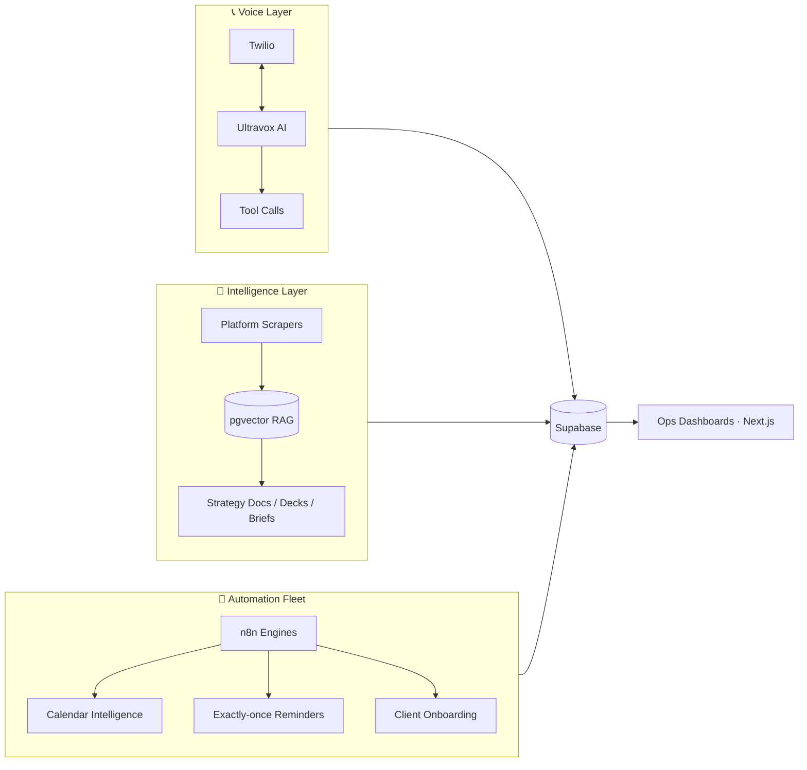

<div align="center">
  
</div>

<p align="center">
  <a href="https://workupsolutions.com"></a>
  <a href="https://verticalvoice.alphaos.tech"></a>
  <a href="mailto:fakhar@alphaaccelerator.net"></a>
  
</p>

> **⚠️ Fair warning about the green squares:** ~95% of my commits live in **private production repos** for client systems.
> What you see below the fold is the visible 5%. The iceberg is under water — and it's running right now, in production, making money while I sleep.

## 🧬 What I do

I don't build demos. I build **autonomous systems that run real businesses** — then I hand over the keys.

- 📞 **AI voice agents** that answer a company's phone line, book appointments, and log every call — multi-tenant, live, taking real calls today
- 🧠 **Content-intelligence engines** that ingest a creator's entire footprint (posts, transcripts, analytics across 5 platforms), ground it in RAG, and generate strategy documents an analyst would charge thousands for
- 🤖 **Automation fleets** — n8n orchestration layers with exactly-once delivery semantics, atomic claim locks, and circuit breakers, because "the reminder email sent twice" is a bug I take personally
- 🛠 **Agentic engineering itself** — I run multi-agent AI dev fleets with eval harnesses, golden corpora (84-video labeled test sets), adversarial verification passes, and calibration loops. My CI reviews my code before any human does.

## ⚡ Systems in production

| System | What it does | Stack | Status |
|---|---|---|---|
| **[VerticalVoice](https://verticalvoice.alphaos.tech)** · [repo](https://github.com/FakharEAli/verticalvoice-ai) | Multi-tenant B2B SaaS — AI calling agents for healthcare, restaurants & real estate. Twilio↔Ultravox voice loop, tool-calling mid-call, full post-call transcript/recording pipeline | TypeScript · Next.js · Supabase · Twilio · Ultravox | 🟢 Live |
| **AlphaOS** *(private)* | An AI operating system for a content agency: cross-platform analytics, RAG-grounded prospect intelligence, auto-generated pitch decks (PDF+PPTX), a podcast production engine, and a WhatsApp agent with 26 tools | Next.js · Supabase/pgvector · Inngest · Clerk · Claude/Gemini | 🟢 Live |
| **Automation fleet** *(private)* | Multi-engine n8n orchestration: client onboarding pipelines, meeting intelligence with deterministic calendar-tag routing, booked-call reminder system with atomic Supabase claims (exactly-once, provably) | n8n · Supabase · Google Workspace | 🟢 24/7 |
| **Outreach infrastructure** *(private)* | Cold-outreach analytics platform + email infrastructure with deliverability monitoring | Next.js · Supabase · Docker · Traefik | 🟢 Live |

## 🧠 How I build

```text
1. Spec it like a contract        — invariants first, features second
2. Test it like an adversary      — golden corpora, eval harnesses, adversarial QA agents
3. Ship it like it's forever      — idempotency keys, circuit breakers, atomic claims
4. Verify it like a skeptic       — render the PDF and LOOK at it; text-grep gives false passes
```

My commit messages read like incident reports — root cause, fix layers, test evidence. Pick any commit in [verticalvoice-ai](https://github.com/FakharEAli/verticalvoice-ai/commits) and judge for yourself.

## 🗺 The ecosystem (10,000 ft view)



## 🛠 Arsenal

**Languages & frameworks**


**AI & agents**


**Infra & orchestration**


## 📡 Recent transmissions

<!--START_SECTION:activity-->
- 🚢 Shipping in private production repos — the public feed catches up when the work surfaces
<!--END_SECTION:activity-->

## 🐍 Contribution graph, being eaten

<picture>
  <source media="(prefers-color-scheme: dark)" srcset="https://raw.githubusercontent.com/FakharEAli/FakharEAli/output/github-snake-dark.svg"/>
  <source media="(prefers-color-scheme: light)" srcset="https://raw.githubusercontent.com/FakharEAli/FakharEAli/output/github-snake.svg"/>
  
</picture>

---

<div align="center">

**Want software that runs your business while you sleep?**

[](mailto:fakhar@alphaaccelerator.net)
[](https://workupsolutions.com)

<sub>⚡ This README maintains itself — GitHub Actions update it while I'm building.</sub>

</div>
