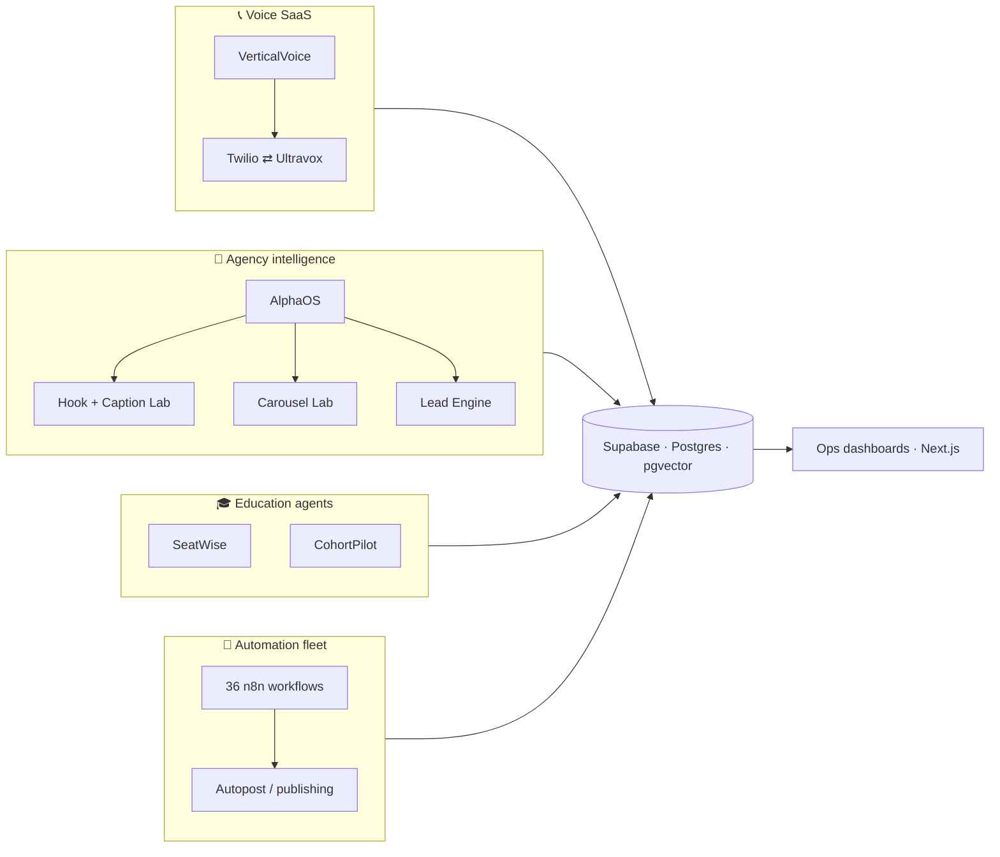

<div align="center">
  
</div>

<h1 align="center">Fakhar E Ali</h1>
<p align="center"><b>AI Systems Architect</b> · Founder, <a href="https://workupsolutions.com">Workup Solutions</a></p>

<p align="center">
  <a href="https://workupsolutions.com"></a>
  <a href="https://verticalvoice.alphaos.tech"></a>
  <a href="mailto:alifakhar816@gmail.com"></a>
  <a href="https://github.com/FakharEAli/portfolio"></a>
  
</p>

**What I build:** multi-tenant SaaS, AI agents and automation fleets that run real businesses, in TypeScript, Next.js, Supabase/Postgres and n8n.
**How:** agentic engineering with Claude Code, spec first, verification before ship, deterministic gates behind every model.
**Proof:** 14 systems documented with real screenshots in the [portfolio hub](https://github.com/FakharEAli/portfolio). About 95% of my commits live in private production repos; the case studies are the tour.

## 🏛 What I build

| Pillar | What it means | Flagships |
|---|---|---|
| 📞 **AI Voice SaaS** | Multi-tenant voice agents that answer a business's phone, book the appointment and enforce industry compliance deterministically | [VerticalVoice](https://github.com/FakharEAli/verticalvoice-ai-receptionist) |
| 🎓 **Education-vertical AI agents** | Grounded assistants for training providers and academies: funding checks, level placement, enrolment, nurture sequences, with deterministic engines behind every model | [SeatWise](https://github.com/FakharEAli/seatwise-enrolment-agent) · [CohortPilot](https://github.com/FakharEAli/cohortpilot-admissions-ai) |
| 🎬 **Content-agency operating stack** | The analytics, clip-selection, creative-QC, prospecting and roster-management systems a content agency actually runs on | [AlphaOS](https://github.com/FakharEAli/alphaos-agency-os) · [Clipper Tracking](https://github.com/FakharEAli/clipper-tracking-pwa) · [Carousel Lab](https://github.com/FakharEAli/carousel-lab-ai) · [Hook + Caption Lab](https://github.com/FakharEAli/hook-caption-lab) |

## 🖼 Featured systems

<table>
  <tr>
    <td width="33%" valign="top">
      <a href="https://github.com/FakharEAli/verticalvoice-ai-receptionist"></a><br/>
      <a href="https://github.com/FakharEAli/verticalvoice-ai-receptionist"><b>VerticalVoice</b></a> 🟢 Live<br/>
      <sub>Multi-tenant AI receptionist for healthcare, restaurants and real estate: one compiler, three industry packs, compliance enforced before any tool runs.</sub>
    </td>
    <td width="33%" valign="top">
      <a href="https://github.com/FakharEAli/alphaos-agency-os"></a><br/>
      <a href="https://github.com/FakharEAli/alphaos-agency-os"><b>AlphaOS</b></a> 🟢 In production<br/>
      <sub>Operating system for a premium content agency: cross-platform analytics, 25 AI intelligence modules, a benchmarked clip extractor, meeting knowledge and pre-sales tooling.</sub>
    </td>
    <td width="33%" valign="top">
      <a href="https://github.com/FakharEAli/seatwise-enrolment-agent"></a><br/>
      <a href="https://github.com/FakharEAli/seatwise-enrolment-agent"><b>SeatWise</b></a> 🟡 Pilot<br/>
      <sub>A sourced, dated, rule-cited net fee for funded courses in seconds, and the seat booked in the same conversation.</sub>
    </td>
  </tr>
  <tr>
    <td width="33%" valign="top">
      <a href="https://github.com/FakharEAli/cohortpilot-admissions-ai"></a><br/>
      <a href="https://github.com/FakharEAli/cohortpilot-admissions-ai"><b>CohortPilot</b></a> 🟡 Pilot<br/>
      <sub>The admissions officer that never sleeps: grounded answers, weighted level placement, kanban pipeline and conversation-driven nurture sequences.</sub>
    </td>
    <td width="33%" valign="top">
      <a href="https://github.com/FakharEAli/clipper-tracking-pwa"></a><br/>
      <a href="https://github.com/FakharEAli/clipper-tracking-pwa"><b>Clipper Tracking</b></a> 🟢 In production<br/>
      <sub>Mobile-first PWA running a freelance clipper roster: post calendar, labelling, trial-reel routing, weekly PDF report, champions and streaks.</sub>
    </td>
    <td width="33%" valign="top">
      <a href="https://github.com/FakharEAli/carousel-lab-ai"></a><br/>
      <a href="https://github.com/FakharEAli/carousel-lab-ai"><b>Carousel Lab</b></a> 🟢 In production<br/>
      <sub>Transcript to on-brand Instagram carousel in about two minutes: AI decides, a deterministic renderer draws, nine QC gates check, a human approves.</sub>
    </td>
  </tr>
</table>

## 🧰 More systems

| System | What it does | Stack | Status |
|---|---|---|---|
| [**Automation Fleet**](https://github.com/FakharEAli/n8n-automation-fleet) | 36 n8n workflows across two self-hosted instances: onboarding, meeting intelligence, exactly-once reminders, prospecting, publishing, syncs | n8n · Supabase · Google Workspace · Docker · Traefik | 🟢 In production |
| [**Hook + Caption Lab**](https://github.com/FakharEAli/hook-caption-lab) | Generator and critic agents for on-screen hooks and client-voice captions; a written standard compiled into deterministic gates plus a blind eval harness | Next.js · pgvector · Gemini · PM2 · Traefik | 🟢 In production |
| [**Lead Engine**](https://github.com/FakharEAli/lead-discovery-engine) | Two-arm lead engine: podcast clip-gap discovery plus real-time intent monitoring, ICP scoring with tiers, AI openers every morning | Python · Next.js · Supabase · Apify · Claude · Gemini | 🟢 In production |
| [**Outreach Dashboard**](https://github.com/FakharEAli/outreach-analytics-dashboard) | Dark-first KPI dashboard for a three-person outreach team: 8-stage funnel, trends, leaderboard, goal pacing, CSV and PDF export, RLS-enforced ownership | Next.js · Supabase · Recharts · Framer Motion | 🟢 In production |
| [**Social Connect**](https://github.com/FakharEAli/social-connect-onboarding) | Signed-link creator onboarding: the agency mints an HMAC-signed link, the creator connects Instagram, Facebook, YouTube and TikTok in four clicks | Next.js · HMAC · Docker · Traefik | 🟢 In production |
| [**Podcast to Clips**](https://github.com/FakharEAli/podcast-to-clips-engine) | One episode in, 10 to 12 finished YouTube videos out: transcribe, segment, cut, thumbnail, copy, review, publish, learn | Node/TS · Express · Postgres · BullMQ · Deepgram · Gemini · ffmpeg | ⚪ Internal |
| [**Viral Script Generator**](https://github.com/FakharEAli/viral-script-generator) | Ten ranked short-form scripts in a creator's own voice: ingest reels, extract patterns, build a voice profile, generate with a critic loop | Next.js · pgvector · Claude · Gemini · Cohere · Deepgram | ⚪ Internal |
| [**Autopost AI**](https://github.com/FakharEAli/autopost-ai-scheduler) | v1 social scheduling and analytics with a clipper leaderboard and six-role access; the AlphaOS predecessor | Express · Prisma · Supabase · S3 · Gemini · PM2 | ⚪ Superseded |

→ **[All 14 case studies](https://github.com/FakharEAli/portfolio)**

## 📈 By the numbers

| | |
|---|---|
| **14** systems documented, every one shipped to production or pilot | **60** real screenshots (seeded demo data) across the case studies |
| **3** live products you can open today: [VerticalVoice](https://verticalvoice.alphaos.tech), [SeatWise](https://seatwise.workupsolutions.com), [CohortPilot](https://cohortpilot.workupsolutions.com) | **36** n8n workflows running around the clock across two self-hosted instances |
| **25** AI intelligence modules behind a versioned prompt registry in AlphaOS | **1,259** human-labelled moments across **179** videos: the frozen clip-selection benchmark |
| **~90** tables under **30** Row-Level Security policies in VerticalVoice's multi-tenant schema | **~1,538** tests and **39** SQL migrations behind Clipper Tracking |
| **10**-step onboarding wizard and **10**-step policy pipeline: a new voice tenant is live in 5 to 10 minutes | **9** deterministic QC gates before any carousel leaves the building |

## 🧠 How I build

```text
1. Spec it like a contract        -> invariants first, features second
2. Test it like an adversary      -> golden corpora, eval harnesses, adversarial QA agents
3. Ship it like it's forever      -> idempotency keys, circuit breakers, atomic claims
4. Verify it like a skeptic       -> render the PDF and LOOK at it; text-grep gives false passes
5. Keep the model on a leash      -> code, not the LLM, has the last word
```

- **Agentic engineering with Claude Code.** Multi-agent dev workflows: spec first, then implementation, then adversarial review passes, with the written spec committed and audited clause by clause.
- **Verification before ship.** Golden sets, blind eval modes, acceptance suites over HTTP, and deterministic gates a generous model cannot talk its way past.
- **VPS + Docker + Traefik ops.** Standalone containers behind one Traefik instance with automatic TLS, health endpoints the orchestrator actually watches, one-command deploys and rollbacks, PM2 and GitHub Actions where they fit.
- **Supabase / Postgres everywhere.** Row-Level Security for tenant isolation, pgvector for RAG, parameterised repositories with `server-only` guards, idempotent migrations, integer cents for money.

## 🗺 The ecosystem


```mermaid
flowchart LR
    subgraph Voice["📞 Voice SaaS"]
        VV[VerticalVoice] --> TW[Twilio ⇄ Ultravox]
    end
    subgraph Intel["🧠 Agency intelligence"]
        AOS[AlphaOS] --> HCL[Hook + Caption Lab]
        AOS --> CL[Carousel Lab]
        AOS --> LE[Lead Engine]
    end
    subgraph Edu["🎓 Education agents"]
        SW[SeatWise]
        CP[CohortPilot]
    end
    subgraph Fleet["🤖 Automation fleet"]
        N8N[36 n8n workflows] --> AP[Autopost / publishing]
    end
    Voice --> DB[(Supabase · Postgres · pgvector)]
    Intel --> DB
    Edu --> DB
    Fleet --> DB
    DB --> DASH[Ops dashboards · Next.js]
```

## 🛠 Arsenal

**Frontend**


**Backend & data**


**AI**


**Ops**


## 📡 Recent transmissions

<!--START_SECTION:activity-->
1. 🎉 Merged PR [#1](https://github.com/FakharEAli/verticalvoice-ai/pull/1) in [FakharEAli/verticalvoice-ai](https://github.com/FakharEAli/verticalvoice-ai)
<!--END_SECTION:activity-->

## 🐍 Contribution graph

<picture>
  <source media="(prefers-color-scheme: dark)" srcset="https://raw.githubusercontent.com/FakharEAli/FakharEAli/output/github-snake-dark.svg"/>
  <source media="(prefers-color-scheme: light)" srcset="https://raw.githubusercontent.com/FakharEAli/FakharEAli/output/github-snake.svg"/>
  
</picture>

---

<div align="center">

**Work with me**

[](mailto:alifakhar816@gmail.com)
[](https://workupsolutions.com)

<sub>Source code for any system available under NDA.</sub><br/>
<sub>⚡ This README maintains itself. GitHub Actions update it while I'm building.</sub>

</div>
